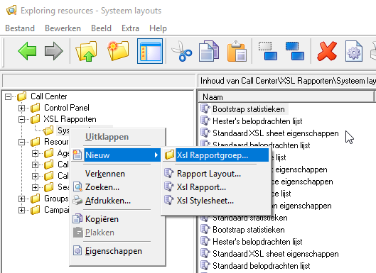
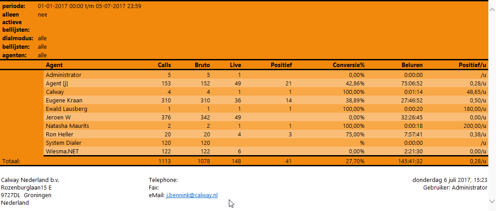
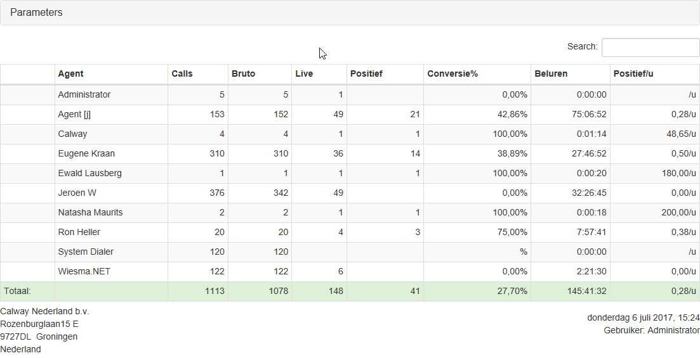

De CallPro XSL rapportages in de Resource Explorer maken gebruik van XML/XSL voor de weergave van de rapporten. Hierdoor is de opmaak van het rapport volledig aan te passen aan de bedrijfsstandaarden voor opmaak en layout. Hoewel dit een krachtige optie is wordt deze niet veel gebruikt omdat XSL transformaties niet erg gebruikervriendelijk zijn. Toch valt het best mee om de standaard opmaak van de rapporten aan te passen en om deze geavanceerde optie in CallPro onder de aandacht te brengen bij meer gebruikers geven we hier een simpel voorbeeld met Bootstrap en datatables.net tabellen.

## Stap 1 - Maak een nieuwe XSL stylesheet
Om te beginnen maken maken we een nieuwe XSL stylesheet die wordt gebruikt in de nieuwe rapport layout. Ga in de Resource Explorer naar XSL Rapporten en right-click op "Systeem layouts". Kies dan "Nieuw\Xsl Stylesheet..."

Noem deze stylesheet "Bootstrap statistieken". Op het tweede tabblad "Stylesheet" druk op "Ophalen stylesheet", er volgt een melding dat de stylesheet eerst zal worden opgeslagen, klik OK. Nu kan de stylesheet inhoud worden ingevuld. Download het bestand "<a href="https://raw.githubusercontent.com/calway/Tools-and-scripts/master/Rapportage/XSL%20Rapportage/stylesheets/Bootstrap%20statistieken.txt" target="_blanc">bootstrap statistieken.txt</a>" en plak de inhoud in het editor venster. Bewaar nu de stylesheet door het eigenschappen venster te sluiten met OK. De stylesheet is klaar om gebruikt te worden in een rapport template.
## Stap 2 - Maak een nieuwe rapport layout
Herhaal nu de actie, maar maak nu een nieuwe "Rapport layout".  Ga in de Resource Explorer naar XSL Rapporten en right-click op "Systeem layouts". Kies dan "Nieuw\Rapport layout..." Noem de nieuwe template "Bootstrap statistieken" en druk op "Toepassen" om de layout op te slaan. Ga nu naar het tweede tabblad en druk op "Toevoegen..." Navigeer naar de "Systeem layouts" folder en kies daar de zoljuist gemaakte Xsl stylesheet "Bootstrap statistieken".
## Stap 3 - (optioneel) Vervang de template voor bestaande rapporten
Deze stap is optioneel maar als je de bestaande rapporten van deze mooie nieuwe layout wilt voorzien doorloop dat deze stappen. Start de belhistorie statistieken wizard en kies een sjabloon. Doorloop de wizard tot "stap 5 - selecteer de layout" en kies nu de nieuwe "Bootstrap statistieken" rapport layout. Druk op "Volgende" en in stap 6 "Overschrijf het geselecteerde sjabloon" om de wijziging in de rapport layout op te slaan. Herhaal dit voor alle bestande sjablonen die aangepast moeten worden.
## Resultaat
Voordat we de bootstrap layout hebben ingesteld zien de Xsl Rapporten er zo uit

Nadat we de bootstrap template hebben toegepast

