# Wijzigen status van belopdrachten

Er zijn meerdere redenen om de status van belopdrachten te wijzigen. De meest voorkomende is als de belvoorraad te laag wordt. Dit kan ontstaan doordat de opdrachtgever geen extra belopdrachten kan aanleveren ofhet bereik (tijdelijk) heel laag is waardoor de belopdrachten sneller worden verwerkt. Andere redenen zijn bijvoorbeeld een wijziging in de voorwaarden wanneer een lead geschikt is voor het doel waarvoor gebeld wordt. Viel de belopdracht eerder buiten de doelgroep, maar nu niet meeer dan kan de status worden aangepast.

Als het mogelijk is de belopdrachten te selecteren met een filter dan kan de optie "Wijzigen belopdrachten" gebruikt worden om de belopdrachten van status te wijzigen. Deze optie is beschikbaar op de bellijst (right-click \ Wijzigen belopdrachten...) De actie heeft twee stappen, het selectie criterium, en de acties.

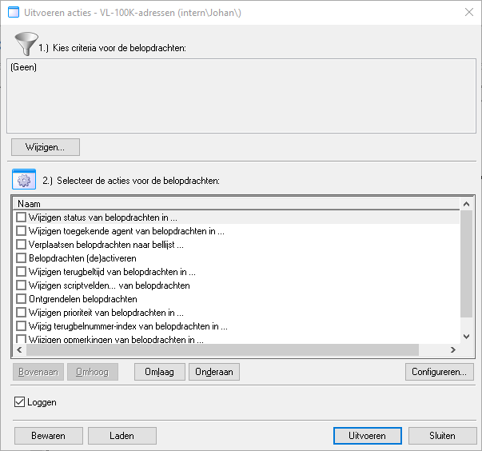

In stap 1 kan het selectie criterium worden ingesteld via Wijzigen... dit toont het Callpro filter scherm voor het maken van selectie filters. Afhankelijk van de voorkeur en/of complexiteit van het filter dat gemaakt wordt kan een van de expressie-builders worden gekozen. Voor dit voorbeeld gebruiken we de "SQL Criteria Lijst"

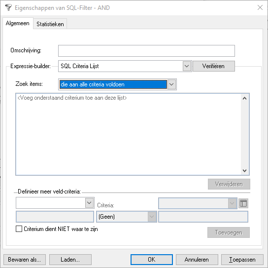

In dit scherm kunenn veld-criteria worden toegevoegd aan het filter om te komen tot de sub-set van belodprachten die we willen wijzigen.

## Omboeken van een bepaalde status
Dit is een voorbeeld van belopdrachten die eerder buiten de doelgroep vielen en nu opnieuw gebeld moeten worden. Alle leads zijn eerder op "Valt buiten doelgroep" gezet een status met statuscode 225 die we als Uitval hadden geclassifeert.

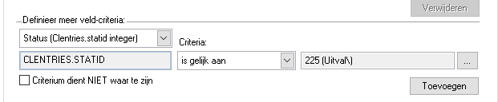

Kies in de veldlijst het systeemveld "Status" als criterium "Gelijk aan" en met de ... knop navigeren we naar de betreffende status en kiezen deze. De status die hier wordt gekozen is een voorbeeld.

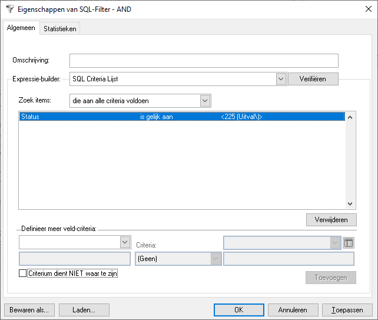

Nadat dit criterium is toegevoegd kunnen we controleren hoeveel belopdrachten voldoen aan door naar het Statistieken tabblad te kijken. In dit voorbeeld is de status niet gebruikt, vandaar dat we in het het voorbeeld de status "Geen gehoor" laten zien. Dit laat zien dat er 37 belopdrachten zijn die voldoen aan het filter.

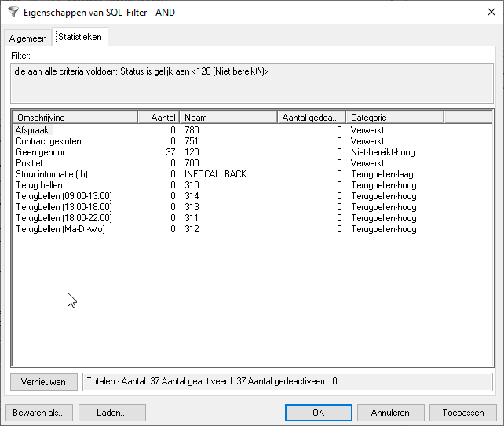

We zijn nu klaar voor de volgende stap, sluit het selectie filter scherm met OK.

## Omboeken van een belopdrachten die voor het laatst gebeld zijn voor
Dit filter kan zowel los, als in combinatie met andere veldcriteria worden gebruikt. We gebruiken dit filter als we niet alle belopdrachten willen wijzigen maar alleen belopdrachten die voor het laatst voor een bepaalde datum gebeld zijn.

We gebruiken hier niet de "Gewijzigd datum" maar "Eindtijd van de laatste belpoging" omdat de gewijzigd datum kan zijn aangepast door eerdere acties, anders dan door te bellen.

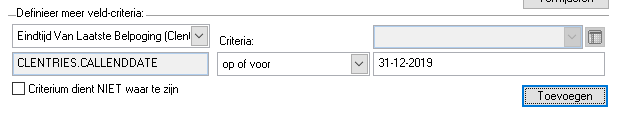

We gebruiken hier het "op of voor" criterium en vullen een datum in om aan te geven dat we alleen geinteresseerd zijn in belopdrachten die voor het laatst voor 31-12-2019 zijn gebeld.

## Omboeken van een bepaald kenmerk van de belopdrachten 
Als laatste voorbeeld willen we een selectie maken van contactpersonen met een bepaalde functie om deze bijvoorbeeld eerder te bellen, of ze juist weg te boeken (niet te bellen). Wij kiezen ervoor om bedrijven waarvan we de Directeur hebben eerder te bellen.

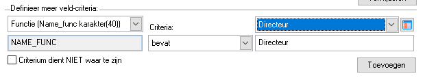

Wij kiezen hier als criterium "Bevat" maar we zouden ook "is exact" kunnen gebruiken. Met "Bevat" vinden we ook functies als "Algemeen Directeur" die bij "is exact" niet worden meegenomen.

# Actie die we willen toepassen op de selectie
Als we eenmaal een selectie hebben gemaakt kiezen we welke actie we willen toepassen. Omdat we de status willen wijzigen laten we hier deze actie zien, maaar het is mogelijk om andere of meerdere acties tegelijkertijd toe te passen.

Omdat we de "Valt buiten doelgroep" weer belbaar willen maken kiezen we een status uit de "Niet bereikt" of "Terugbellen" categorie. In dit voorbeeld gebruiken we een algemene "Terugbellen" status omdat deze eerder wordt aangeboden dan statussen uit de "Niet bereikt" categorie en we willen deze bredere doelgroep snel benaderen.

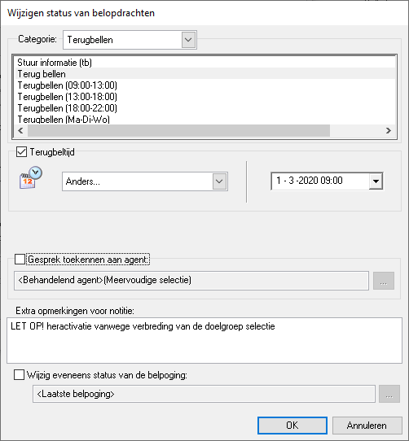

We kiezen niet allee nde status, maar stellen ook eeen initiele terugbeltijd in. Hier 1-3-2020 09:00 Hiermee komen alle belopdrachten vanaf deze datum en tijd beschikbaar voor het bellen. Het is ook mogelijk om een datum in het verleden in te vullen.
Als extra informatie wordt een opmerking aan het notitieveld toegevoegd zodat de agenten zien dat we deze belopdracht opnieuw hebben geactiveerd.

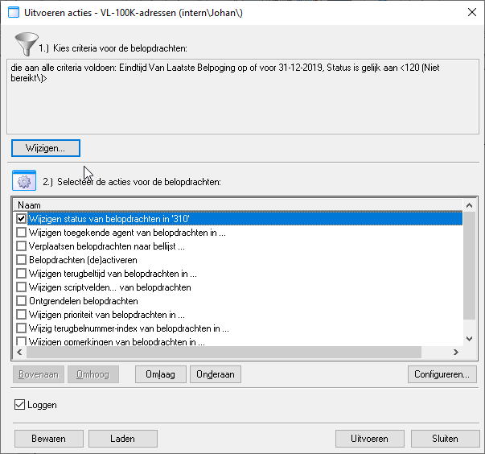

We zijn nu klaar om de acties uit te voeren op de selectie. Druk op Uitvoeren, na bevestiging van de actie worden de belopdrachten gewijzigd.

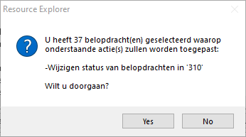

CallPro laat de voortgang zien en meldt eventuele problemen.

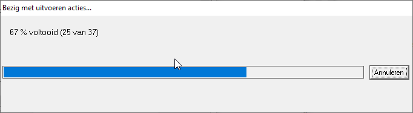
