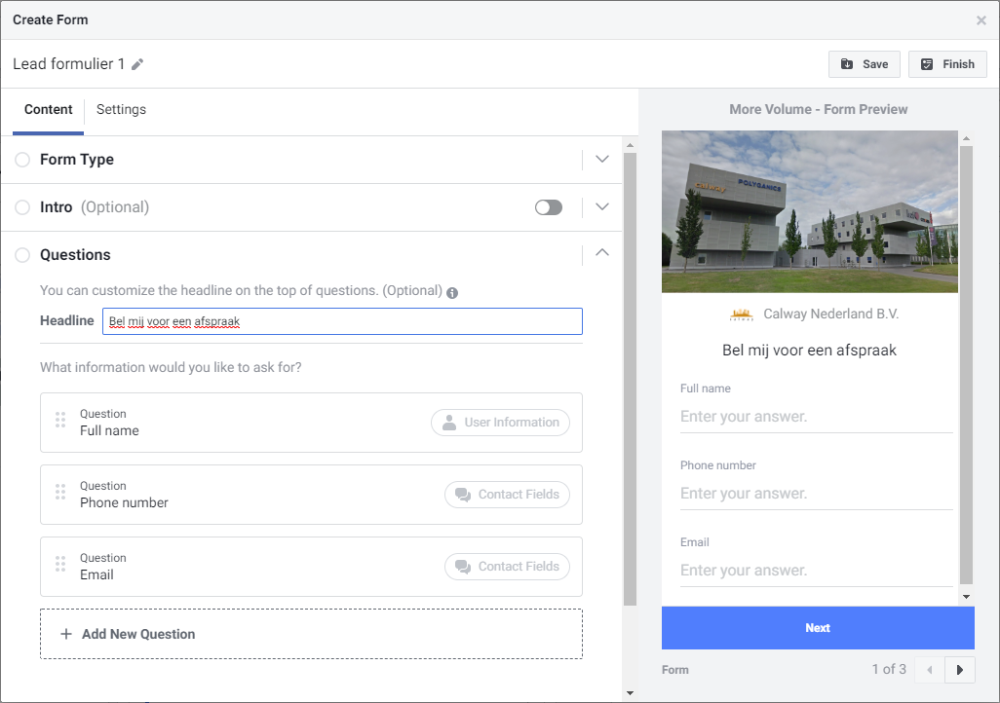
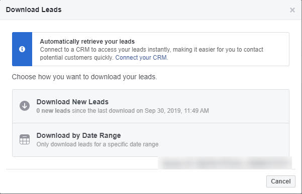
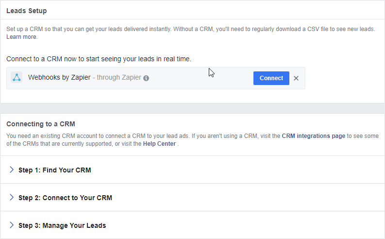
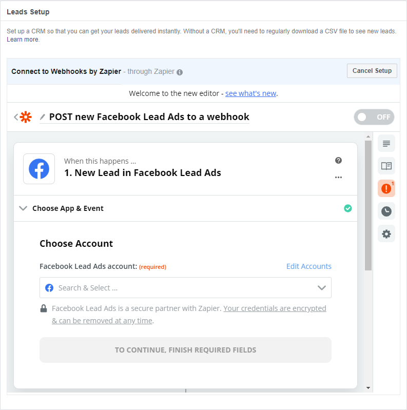
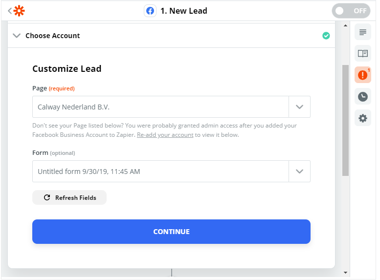
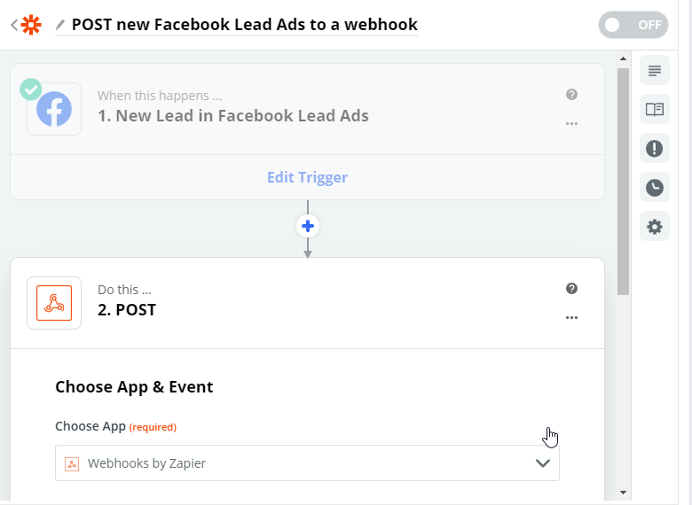
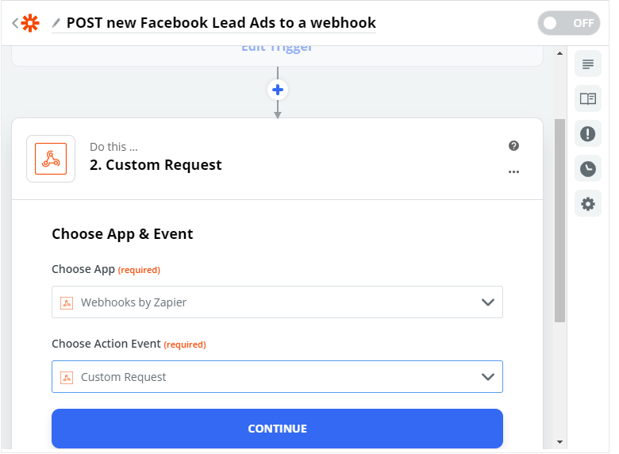
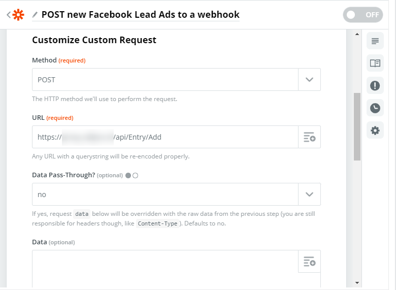
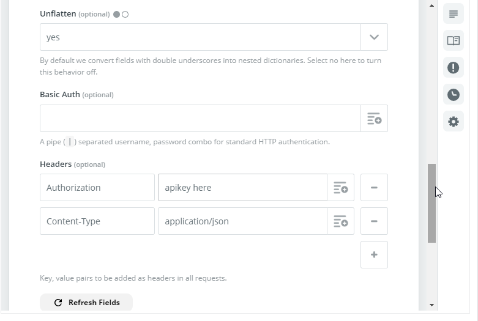
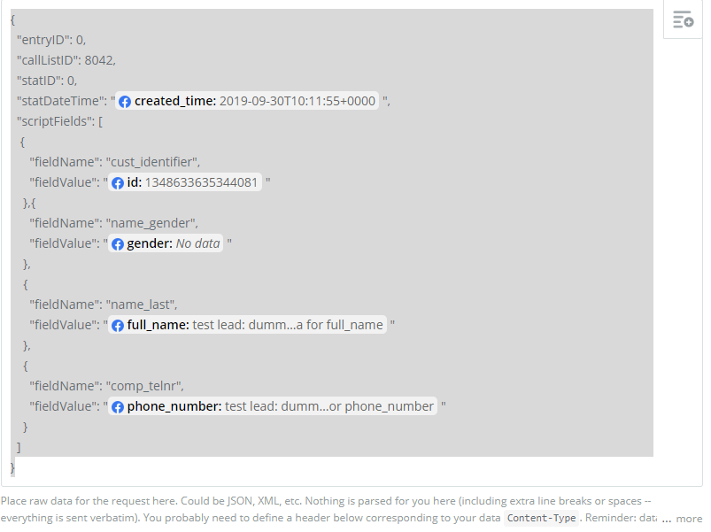

## Belopdrachten toevoegen vanuit Facebook Ads

Als Facebook Ads worden gebruikt voor leadgeneration kan bij de campagne de
optie "Instant Form" functie worden gebruikt om Lead informatie vast te leggen.

> Deze workflow werkt alleen met een betaalde **Zapier Pro** account. Facebook heeft geen directe koppeling naar Microsoft Flow. Ook biedt Facebook geen optie om direct een eigen API op te roepen maar werken ze alleen met commerciele partijen.

Vul in het formulier alle informatie aan die nodig is maar minimaal de naam en het telefoonnummer.

De velden die hier worden opgegeven zijn later beschikbaar samen met informatie over de campagne en de facebook gebruiker.
Vanuit de Facebook Business manager Publishing tools kan voor het Leads Ad form dat eerder is gemaakt bij de Ad campagne een koppeling
worden ingesteld voor CRM. Klik op het betreffende formulier en kies voor "Connect your CRM"

Zoek dan naar de CRM provider "Webhooks by Zapier" en druk op "Connect". 

Als de Zapier koppeling al eens is doorlopen verschijnt direct de Zapier integratie instellingen 
pagina. Is dit de eerste keer dat Zapier wordt gebruikt dan moet de autorisatie nog worden doorlopen.

Kies nogmaals enkele facebook Ad en Form gegevens en ga verder met "Continue". 

Kies dan de pagina en het formulier die eerder zijn voorbereid en druk wederom op "Continue".

Kies hier bij Action Event voor "Custom request" en druk op "Continue".

Vul nu de Callpro API instellingen in, w.o. de custom URL waar de CallPro API op geschikbaar is 
en the apikey (Authorization header).

Vul bij data het json bericht in dat naar de CalLpro API zal worden gestuurd. Hier kan 
gebruik worden gemaakt van de Facebook velden die via het Lead formulier zijn ontvangen. 

Belangrijk is dat de juiste `callListID` wordt gebruikt en dat de `scriptFields` array geldige velden uit CallPro bevat.

