## Belopdrachten toevoegen vanuit een web formulier

Als voorbeeld gebruiken we een Microsoft Form formulier en ee Microsoft Flow workflow om nieuwe belopdrachten toe te voegen aan een bellijst.

Ga naar forms.office.com om een nieuw formulier te maken. Wij kiezen hier een simpel formulier met 3 velden, Naam, Telefoonnummer en Onderwerp. We noemen dit formulier "Call me back".
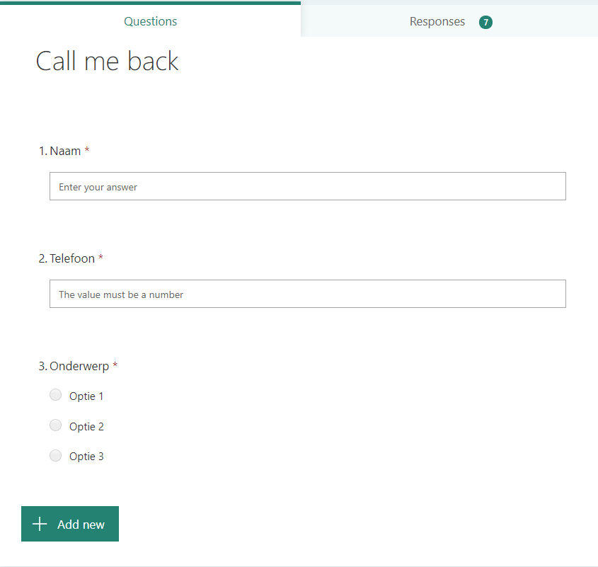

Haal vervolgens de publieke url van dir formulier op bij Share. Gebruik deze url om het formulier te openen.

Ga nu naar Flow en begin een nieuwe blanco Flow van het type "Automated flow". Als trigger kiezen we "When a new response is submitted".

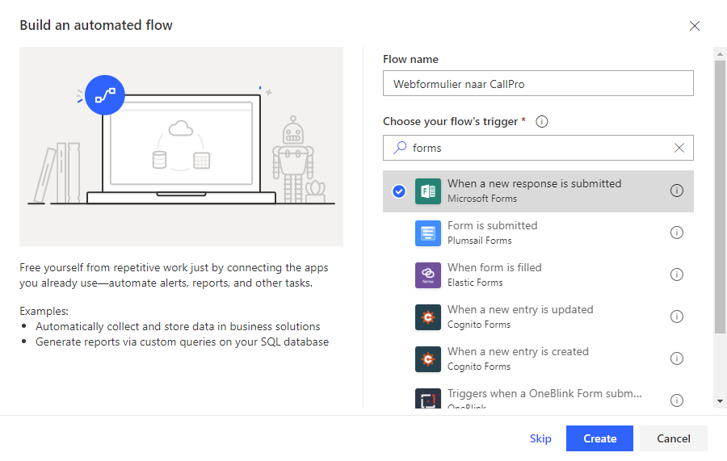

Stel nu het eerder gemaakte formulier in als bron voor de trigger.

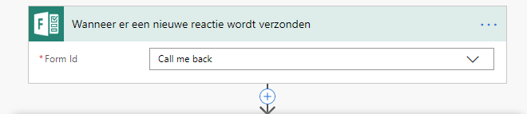

Voeg nu een stap toe en kies hiervoor weer "Forms" Je ziet nu een sub-keuze.

Kies de enige optie "Get response details"en kies nogmaals het formulier en voor Response Id de keuze "List of response notifications Response Id"

Na deze keuze veranderd de weergave in 

!

Voeg nu een nieuwe actie toe en zoek naar "HTTP" en kies de "HTTP actie.

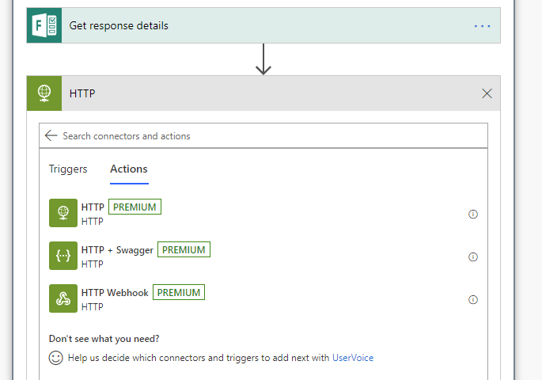
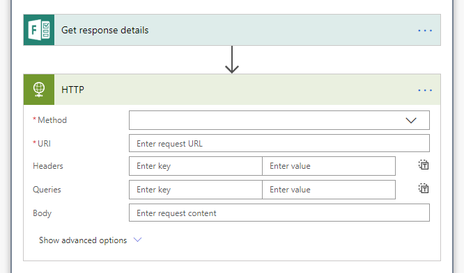

In dit scherm moeten de velden als volgt worden ingevuld:

Method: POST
URI : <url naar callproproxy>/api/Entry/Add
Headers: Authorization = <apikey van een account in callpro die belopdrachten kan toevoegen in de gekozen bellijst>
Body: als onderstaande alleen met een andere callListID waarde en mogelijk andere veldnamen.

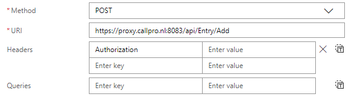
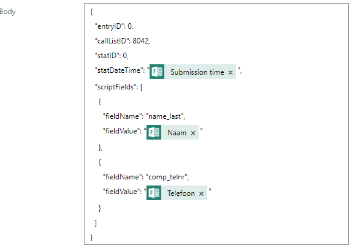

De waarde voor de Authorization header kan worden gemaakt voor eerst naar de callproproxy url te gaan <url>/swagger. Daar te kiezen voor Security en Login en in te loggen met de van te voren gemaakt API account. 

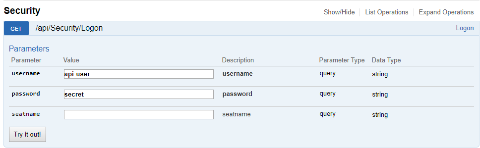

Druk dan op "Try it out!" en de logon wordt uitgevoerd. Als dit lukt wordt een "token" weergegeven. Kopieer die waarde in een variabele "apikey" van type memo bij de betreffende account. Nu kan de api met deze apikey inloggen als de betreffende user en heeft dien rechten. Deze account moet rechten hebben om nieuwe belopdrahcten te maken voor de gekozen bellijst.

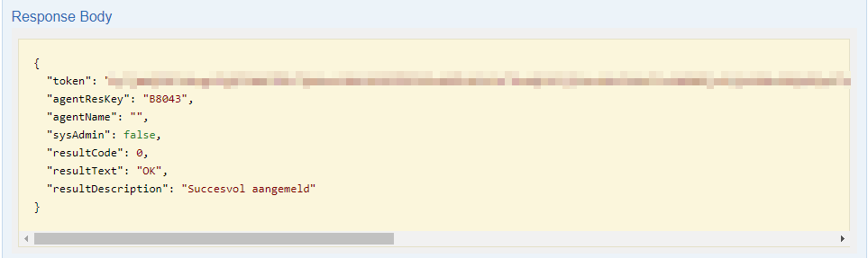

Voor de api-user kan een security rola als hieronder gebruikt worden waarbij de "call me back" bellijst de eerder gebruikt callListId 8042 heeft.

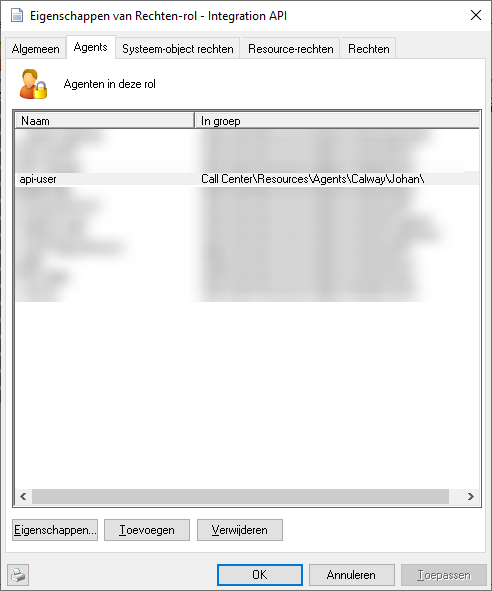
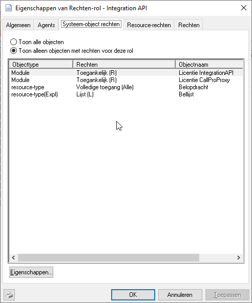
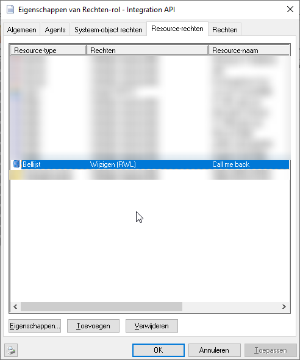
